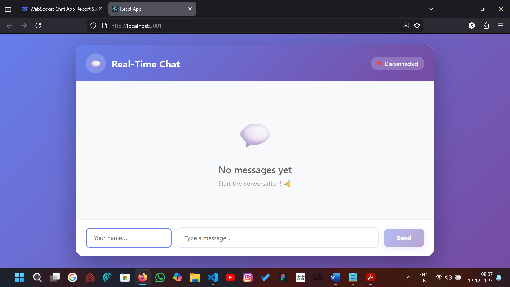
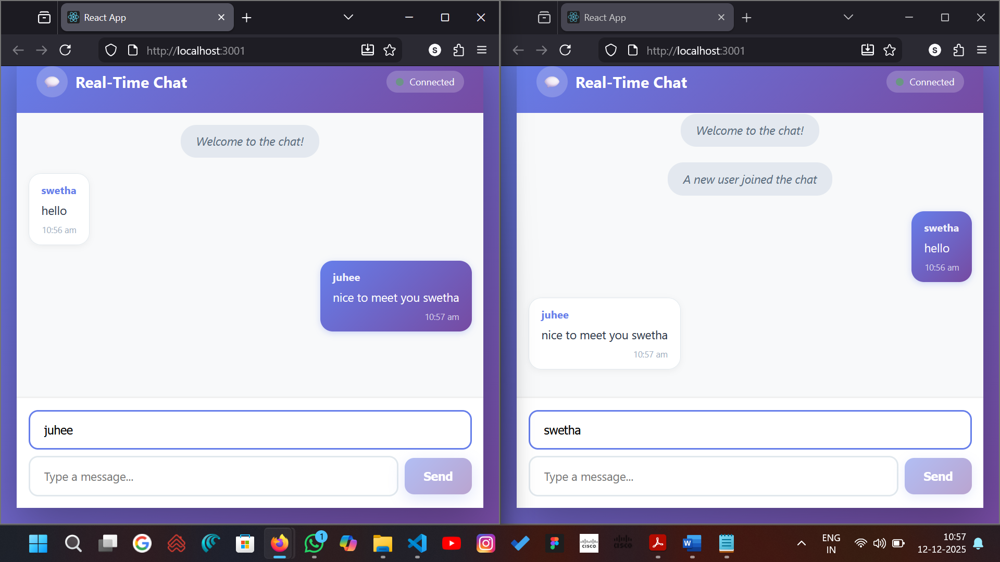
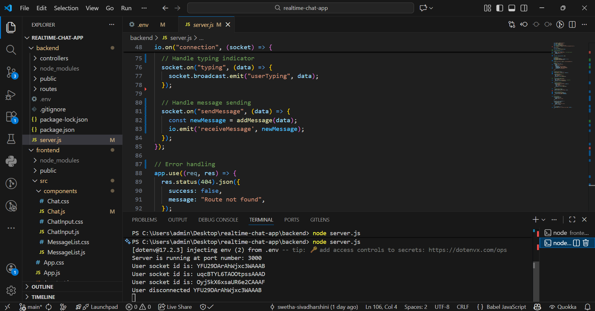

# Real-Time WebSocket Chat Application

A **real-time chat application** that allows users to send and receive messages instantly. Built during a **5-day DevTown Bootcamp**, this project demonstrates WebSocket-based bidirectional communication, live message transmission, and event-driven architecture.

---

## Features

* Real-time messaging without page refresh
* Live message updates with timestamps
* Typing indicators
* User join/leave notifications
* Online/offline status indicators
* Message differentiation (sent vs received)
* Auto-scroll to latest message

---

## Tech Stack

* **Frontend:** React.js, HTML, CSS, JavaScript
* **Backend:** Node.js, Express.js, Socket.IO
* **Database:** In-memory array (mock database)
* **Deployment:** Render (backend) + Netlify/Vercel (frontend)

---

## Bootcamp Info

* **Name:** Real-Time Chat App Bootcamp
* **Duration:** 5 days (6th – 10th Dec 2025)
* **Timing:** 7 PM – 8:30 PM IST
* **Platform:** YouTube

---

## Installation

1. Clone the repository:

```bash
git clone https://github.com/swetha-sivadharshini/realtime-chat-app.git
cd realtime-chat-app
```

2. Install dependencies:

```bash
npm install
```

3. Start the server:

```bash
npm start
```

4. Open your browser and go to:

```text
http://localhost:3000
```

---

## Folder Structure

```bash
realtime-chat-app/
│
├── client/             # React frontend
├── server/             # Backend server (Node.js + Socket.IO)
├── public/             # Static assets (optional)
├── package.json        # Project dependencies
└── README.md           # Project documentation
```

---

## Screenshots


1. **Chat UI** – Shows messages being sent/received.



2. **Message Logs** – Shows message history or in-memory message storage.



3. **Terminal / WebSocket Logs** – Shows server running and connections.




## Future Enhancements

* Add user login with authentication
* Implement chat rooms for group conversations
* Save messages in a database
* Send images, files, and media
* Add voice/video chat support
* Mobile app version
* Notifications for new messages

---

## Conclusion

This project demonstrates **real-time communication** using WebSockets. It teaches how modern apps like WhatsApp, Discord, and Instagram Direct deliver instant messaging by keeping a persistent live connection between clients and the server.

---

